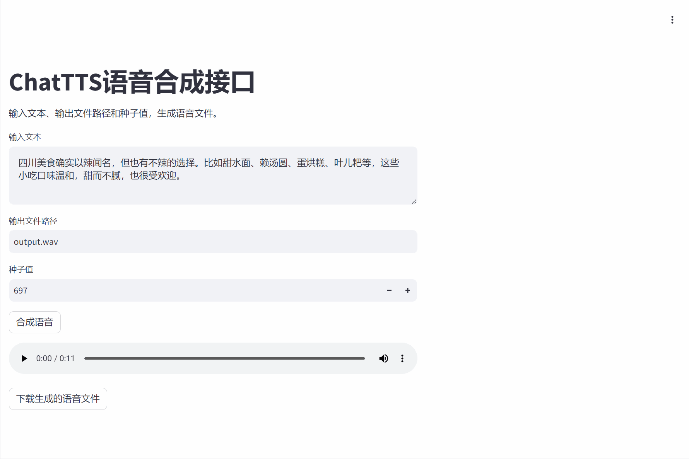

## **一、项目简介**
使用 FastAPI 和 Streamlit 本地部署 ChatTTS 文本转语音模型，并通过 Docker Compose 进行容器化部署。

**操作流程demo：**

## **二、本地安装使用**

**环境依赖：**
 - cuda12.1   
 - pip install requirements.txt

**程序运行方式：**

 - 启动FastAPI：用于 API 接口
    
    cd fastapi
 
    uvicorn server:app --host "0.0.0.0" --port 8000
 - 启动Streamlit：用于网页
 
    cd streamlit
 
    streamlit run ui.py
 - 访问网页：http://localhost:8501   
 - 本地使用示例
      
   curl -X POST -H 'content-type: application/json' -d\
      '{"text":"朋友你好啊，今天天气怎么样 ？", "output_path": "abc.wav", "seed":232}' \
            http://localhost:8000/tts

 - 参数说明：
  
      text：要合成的文本

      output_path：合成音频的保存路径

      seed：音色种子，不同的种子会产生不同的音色，默认为 697（测试的一个比较好的音色）
    
 - 运行客户端

    python client.py

## **三、Docker 部署**

   docker-compose up --build
   
   这个命令将会：
   
   构建FastAPI和Streamlit服务的Docker镜像。
   
   启动两个服务，将FastAPI暴露在8000端口，Streamlit暴露在8501端口。

   要访问生成的服务的 FastAPI 文档，请使用 Web 浏览器访问 http://localhost:8000/docs

   要访问UI，请访问 http://localhost:8501

   可以通过以下方式检查日志：

   docker-compose logs

## **四、 参考**
 - https://github.com/ultrasev/ChatTTS
 - https://github.com/2noise/ChatTTS
